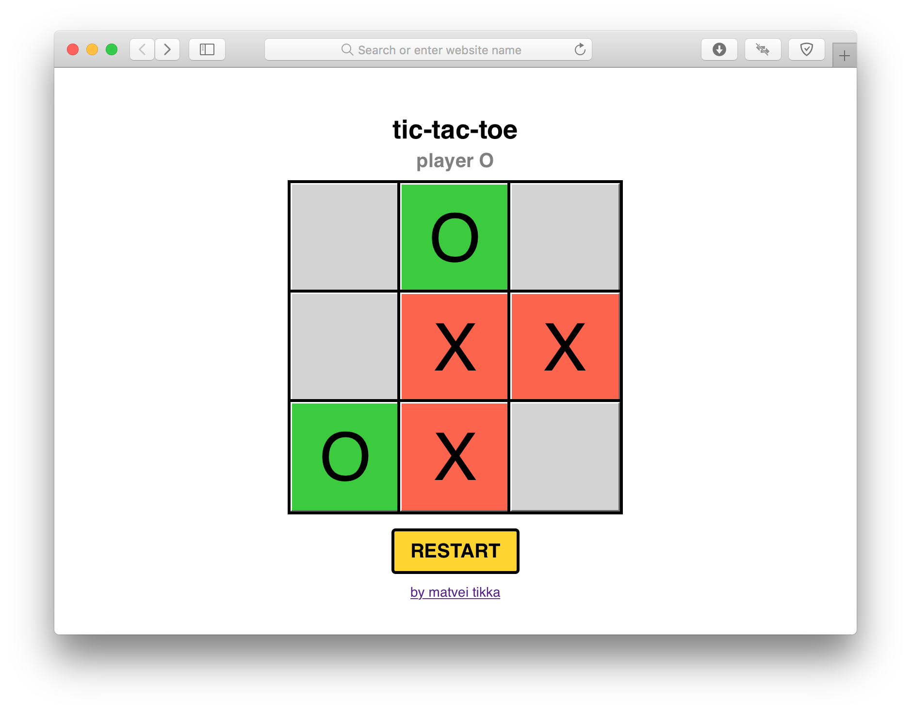

# tic-tac-toe

Demo: www.tikka.top/stuff/tictac/
## Summary
Simple game made using fundamental web development tools: HTML, CSS and JavaScript. It is designed for two individuals to play against each other. Game not only works on desktops, but also adapts to mobile devices.

## How it works
HTML & CSS handles design and responsiveness of the game. JavaScript on the other hand all the game related functions. It triggers notification element and also makes some minor changes in CSS styling.